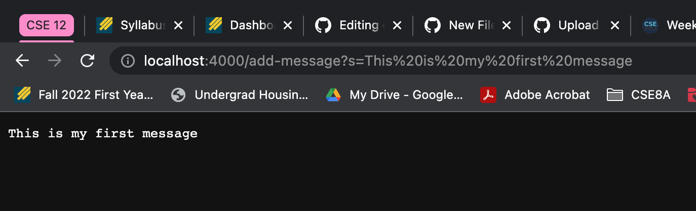
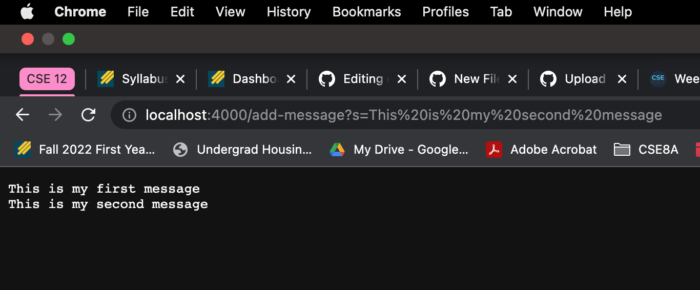
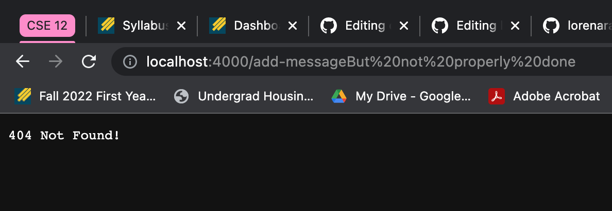

# Lab Report 2 - Servers and Bugs (Week 3)

In this lab report, I will be creating a web server called StringServer that keeps track of a single string that gets added to by incoming requests.
I will then take a look at bugs in the code I was provided. 

## Part 1 - StringServer

In order to create this web server, I used last weeks lab as a template. 

Here is my code for StringServer.java:
```
import java.io.IOException;
import java.net.URI;

class Handler implements URLHandler {
    String messages = "";

    public String handleRequest(URI url) {
        if (url.getPath().equals("/")) {
                return messages;
            }

        else if (url.getPath().equals("/add-message")) {
            String[] parameters1 = url.getQuery().split("=");
            if (parameters1[0].equals("s")){
                messages = messages + parameters1[1] + "\n";
                return messages;
            }
            return messages;
        } 
        
        else {
            return "404 Not Found!";
        }
    }
}

class StringServer {
    public static void main(String[] args) throws IOException {
        if(args.length == 0){
            System.out.println("Missing port number! Try any number between 1024 to 49151");
            return;
        }

        int port = Integer.parseInt(args[0]);

        Server.start(port, new Handler());
    }
}
```
(Aside from this code, I used the Server.java file from last lab).

In the terminal I compiled my code and ran `java StringServer 4000`.
The output is shown below.
`Server Started! Visit http://localhost:4000 to visit.`

After visiting this web server that I have created, I added a path and query to this url. It should look something like the following: 
`/add-message?s=<string>`. 

I tagged on `/add-message?s=This is my first message` to my existing url and hit enter. The screenshot below was the output. 


        Since the url was typed properly, I received the output I was expecting. The method that I was calling was `handleRequest(URI url)`. 
        
The relevant arguments that to this method is the url. In my case for this example, it was `http://localhost:4000/add-message?s=This is my first message`. After I hit enter, it turned into `http://localhost:4000/add-message?s=This%20is%20my%20first%20message`, presumably becasue of the spaces I typed. This is relevant because it would be used to figure out what message would have to be added to my variable `messages`. 
   
In my code, I made an empty string. One of the relevant fields was this string variable that I called, `messages`. Whenever I provided a request for a new message, this variable would be updated and then printed out, each message on a new line. 
   
I ran a similar request as seen below. 


I wanted to try a different variation of this request, hoping that I would get an error message. 


I didn't request a message properly. The method handleRequest(URI url) executes the else statement that resulted in the error message "404 Not Found!". My variable `messages` did not get changed because this argument was not able to satisfy the if statement, `if (parameters1[0].equals("s"))` since there was no query found.  


## Part 2 - Bugs 

In this portion of the lab, I will debug the file ArrayExamples.java. 

An example of a JUnit test that won't produce any errors was:
```
public class ArrayTests {
	@Test 
	public void testReverseInPlace() {
    int[] input1 = { 3 };
    ArrayExamples.reverseInPlace(input1);
    assertArrayEquals(new int[]{ 3 }, input1);
    
    }
}
```

Since this test only contains one element in the array, the output would be the same, regardless of the buggy code. 

A test that would induce a failure would be:
```
int[] input2 = {1, 2, 3};
    ArrayExamples.reverseInPlace(input2);
    assertArrayEquals(new int[]{3, 2, 1}, input2);
```

Since this array has more than one element, it would not pass because the output is not the same as the input. 

When I ran these two tests with the buggy code, I received the output below.


This is the buggy code beforehand:
```
static void reverseInPlace(int[] arr) {
    for(int i = 0; i < arr.length; i += 1) {
    arr[i] = arr[arr.length - i - 1];
    }
  }

  // Returns a *new* array with all the elements of the input array in reversed
  // order
  static int[] reversed(int[] arr) {
    int[] newArray = new int[arr.length];
    for(int i = 0; i < arr.length; i += 1) {
      arr[i] = newArray[arr.length - i - 1];
    }
        return arr;
 }
 ```
 
 
 
 This is the code with the changes I made:
 ```
  static void reverseInPlace(int[] arr) {
    for(int i = 0; i < arr.length/2; i += 1) {
      int temp = arr[i];
       arr[i] = arr[arr.length - i - 1];
      arr[arr.length - i - 1] = temp;
    }
  }

  // Returns a *new* array with all the elements of the input array in reversed
  // order
  static int[] reversed(int[] arr) {
     int[] newArray = new int[arr.length];
     for(int i = 0; i < arr.length/2; i += 1) {
        int temp = arr[i];
        newArray[i] = arr[arr.length - i - 1];
        newArray[arr.length - i -1] = temp;
     }
    return newArray;
  }
```

The for loop in reverseInPlace iterated through the whole array rather than only half of the length of the array. I also made a temporary variable to hold arr[i]. This was because we needed to store it somewhere while we change it, and then we refer back to it when changing the later portions of the array, arr[arr.length - i - 1]. If we had iterated throughout the whole array, it would eventually revert back to its original state. 

In reversed, I needed to fix the for loop so that it only iterated throughout half of the array instead. I also needed to make a temp variable, similar to reverseInPlace. I also had to fix the return statement so that it can return our new array, newArray, rather than the original array that wasn’t changed. 

## Part 3 - What I learned
In lab 2, I learned how to build and run a web server on my local computer and how to work with a program that takes a URL as an input. Last lab, we were provided an implementation of a web server that works with the Interface URLHandler. In this lab, I used the knowledge from last lab to modify this implmentation in order to create a different web server. I also learned how to run this server on a remote computer. 


