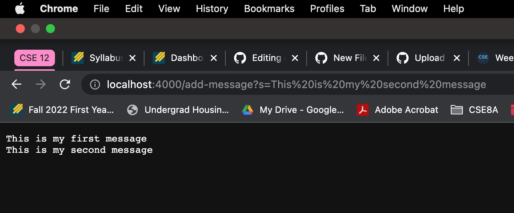

# Lab Report 2 - Servers and Bugs (Week 3)

In this lab report, I will be creating a web server called StringServer that keeps track of a single string that gets added to by incoming requests.
I will then take a look at bugs in the code I was provided. 


In order to create this web server, I used last weeks lab as a template. 

Here is my code for StringServer.java:
```
import java.io.IOException;
import java.net.URI;

class Handler implements URLHandler {
    String messages = "";

    public String handleRequest(URI url) {
        if (url.getPath().equals("/")) {
                return messages;
            }

        else if (url.getPath().equals("/add-message")) {
            String[] parameters1 = url.getQuery().split("=");
            if (parameters1[0].equals("s")){
                messages = messages + parameters1[1] + "\n";
                return messages;
            }
            return messages;
        } 
        
        else {
            return "404 Not Found!";
        }
    }
}

class StringServer {
    public static void main(String[] args) throws IOException {
        if(args.length == 0){
            System.out.println("Missing port number! Try any number between 1024 to 49151");
            return;
        }

        int port = Integer.parseInt(args[0]);

        Server.start(port, new Handler());
    }
}
```
(Aside from this code, I used the Server.java file from last lab).

In the terminal I compiled my code and ran `java StringServer 4000`.
The output is shown below.
`Server Started! Visit http://localhost:4000 to visit.`

After visiting this web server that I have created, I added a path a query to this url. It should look something like the following: 
` /add-message?s=<string>`. 

I tagged on `/add-message?s=This is my first message` to my existing url and hit enter. The screenshot below was the output. 





